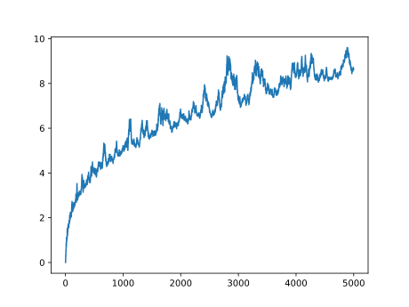

The Farey sequence $`F_n`$ of order $`n`$ is the sequence of fractions between 0 and 1 (inclusive) with denominator less than or equal to $`n`$ in their reduced form, arranged in order of increasing size. For example, the Farey sequence of order 6 is:

$`F_6=\{\frac{0}{1},\frac{1}{6},\frac{1}{5},\frac{1}{4},\frac{1}{3},\frac{2}{5},\frac{1}{2},\frac{3}{5},\frac{2}{3},\frac{3}{4},\frac{4}{5},\frac{5}{6},\frac{1}{1}\}`$

Let $`|F_n|`$ be the number of terms in the sequence excluding $`\frac{0}{1}`$ (so that $`|F_6|=12`$), and $`a_{k,n}`$ be the $`k`$-th term in $`F_n`$.

Now consider the sequence $`U_n`$ with the same number of terms as $`F_n`$, but spaced evenly between 0 and 1:

$`U_n=\{\frac{k}{|F_n|}:0\le k\le|F_n|\}`$

and let $`b_{k,n}`$ be the $`k`$-th term in $`U_n`$. In general, $`a_{k,n}\ne b_{k,n}`$, and let $`d_{k,n}=a_{k,n}-b_{k,n}`$. The following two statements have been shown to be equivalent to the Riemann hypothesis:

$`\sum |d_{k,n}|=O(n^{1/2+\epsilon})`$

$`\sum d_{k,n}^2=O(n^{-1+\epsilon})`$

The program generates the first sum above for $`1\le n\le5000`$ and plots it. The square root shape is apparent in the resulting plot:

